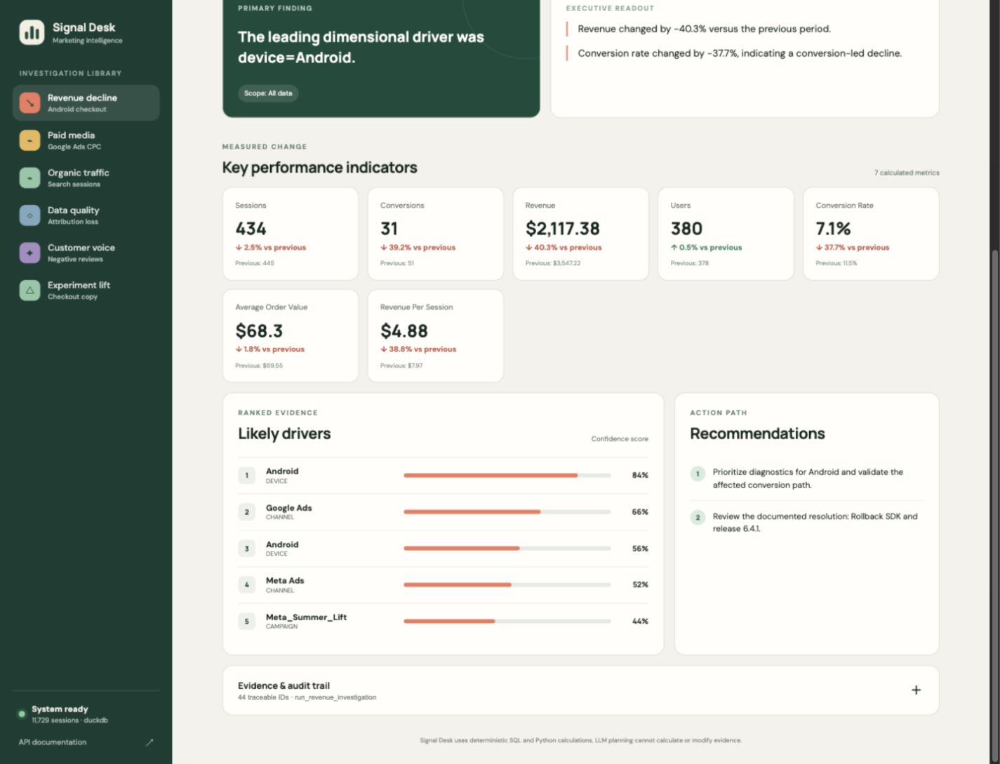
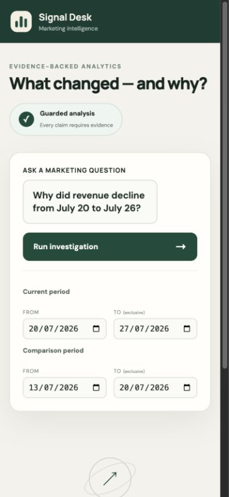

# Signal Desk Dashboard Web UI

Signal Desk is the browser interface for the Multi-Agent Marketing Data Scientist. It runs inside
the existing FastAPI application and displays real, evidence-validated investigation results from
DuckDB.



## What users can see

- A natural-language marketing question form
- Current and comparison period selectors
- Six ready-to-run example investigations
- Executive summary and primary driver
- Current KPI values and period-over-period changes
- Ranked evidence and confidence scores
- Recommended actions
- Applied scope, tool execution, and Critic approval
- Expandable evidence IDs and raw JSON for auditing

## Start the dashboard

From the repository root:

```bash
python3 -m venv .venv
source .venv/bin/activate
pip install -r requirements.txt
python scripts/generate_data.py
python scripts/initialize_database.py
uvicorn src.api.main:app --reload
```

Open the dashboard at <http://127.0.0.1:8000/>.

Interactive API documentation remains available at <http://127.0.0.1:8000/docs>.

## Use Ollama planning

Start Ollama and make sure `qwen3:8b` is installed:

```bash
ollama serve
ollama pull qwen3:8b
```

Start the application with local LLM planning:

```bash
PLANNING_PROVIDER=ollama OLLAMA_MODEL=qwen3:8b uvicorn src.api.main:app --reload
```

Ollama remains advisory. The deterministic consensus guard replaces invalid or disagreeing plans
before analysis executes.

## Run an investigation

1. Select an investigation from the left sidebar or write a question.
2. Set two non-overlapping date ranges of equal duration. End dates are exclusive.
3. Select **Run investigation**.
4. Review the primary finding, KPI changes, ranked drivers, and recommendations.
5. Open **Evidence & audit trail** to inspect evidence IDs and the complete API response.

## Example request

Use the following values for the injected Android checkout scenario:

- Question: `Why did revenue decline from July 20 to July 26?`
- Current period: `2026-07-20` to `2026-07-27`
- Comparison period: `2026-07-13` to `2026-07-20`

The expected primary driver is `device=Android`, with evidence linking the decline to the checkout
and payment transition.

## Source files

The production dashboard assets are intentionally colocated with the FastAPI application:

- `src/api/static/index.html` — dashboard structure
- `src/api/static/styles.css` — visual and responsive design
- `src/api/static/app.js` — API calls and result rendering
- `src/api/main.py` — root route and static asset serving

## Screenshots

### Desktop investigation results


### Mobile question form


